# **German Traffic Sign Recognition** 

**The goal of this project is to build a classificaton system using a convoluational neural network that can identify German traffic signs with accuracy greater than 93%.**

This summary contains the following sections.
* The German traffic sign data set
* The cnn (convoluation neural network) model
* The model's predictions for 5 images taken from Google Street View

### The German traffic sign data set. 

#### Summary Statistics
The German traffic sign data set was provided from the site http://benchmark.ini.rub.de.  The data was provided in a python pickle format and was already divided into training, validation and test sets.  The data had the following characteristics.

| Charasteric   |   Value	| 
|:-------------:|:---------:| 
| Size of the training set   | 34,799 | 
| Size of the validation set | 4,410 |
| Size of the test set		 | 12,630 |
| Shape of a traffic sign image	 | 32x32x3 |
| Number of unique classes/labels | 43 |

#### Types of signs in the training set
The unqiue types of traffic signs in the training set are shown in the following image.  The signs were labeled numerically from 0 to 42 and are shown in numeric order.

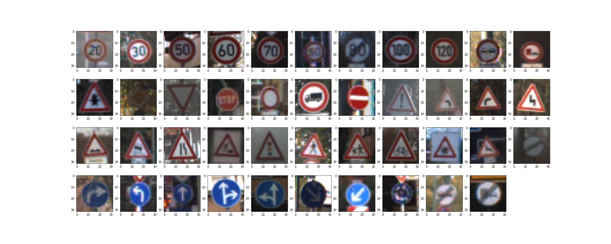

For the training set, the total count of each sign is shown in the following bar chart. The smallest class has only 180 examples whereas the largest class has 2010 examples.

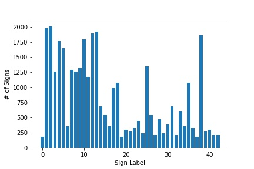

### The CNN (Convolutional Neural Network)

#### Enlarging the data set
A deep and predictive CNN has a large number of parameters.  A large training set is needed to make a good estimate of the parameters of the model.  The training set was increased using the following steps.

* Flipping signs.  The first step was to find signs that could be flipped into themselves or into other signs.  Examples of these types of signs are shown below. The data set was enlarged by taking the flipped images and adding them to the data set.
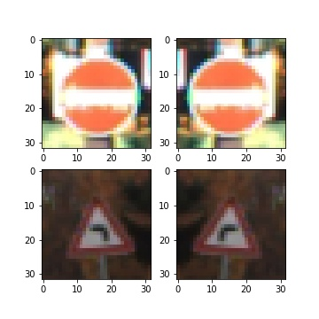

* Warping signs.  The next step was to take signs, warp them, and then add the warped signs back to the data set.  The signs were warped by taking the corners of the images and letting them randomly shift by up to 15% in both the vertical and horizontal direction.  Once the new positions of the corners were calculated, the opencv functions getPerspectiveTransform and warpPerspective were used to tranform the images into a warped images.  An example is shown below. 
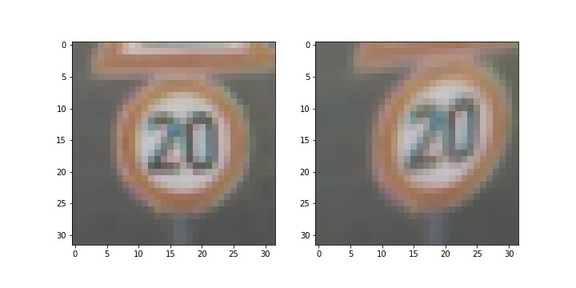

The resulting training data set now contains 3000 images per sign. This is a total of 129,000 images which is about 3 times the original set. The flipping and warping of the signs is realistic since one often sees a sign from an angle.  Enlarging the training data set in this manner increased the accuracy of the model by 2% on the validation set.

####  Preprocessing the data 
All signs were processed by first converting them from color to gray, and then by normalizing them.  Each sign was normalized by subtracting the average of it's pixel values from itself and then dividing by 128.  An example is shown below.

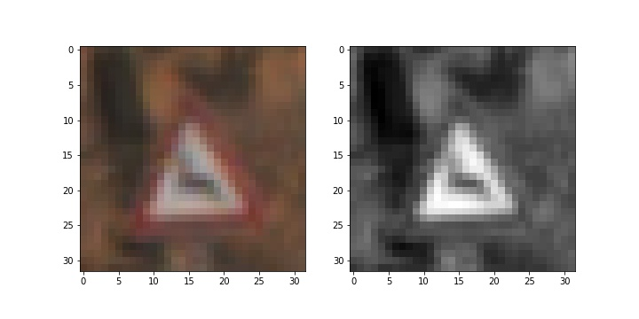

####  Model architecture.  
1.  **Architecture:**  The CNN model has the following architecture.  It's design was motivated by ["Traffic Sign Recognition with Multi-Scale Convolution Networks" by Pierre Sermananet and Yann LeCun] (http://yann.lecun.com/exdb/publis/pdf/sermanet-ijcnn-11.pdf) and information from the website http://benchmark.ini.rub.de/.  The structure of the model is given in the following table.

| Layer         		|     Description	        					| 
|:---------------------:|:---------------------------------------------:| 
| Input         		| 32x32x1 Grayscaled image						| 
| **Convolution 3x3**  	| 1x1 stride, valid padding, outputs 30x30x64 	|
| RELU					| 									        	|
| Max pooling	      	| 2x2 stride,  outputs 15x15x64 				|
| Dropout               | keep probability = 80%                        | 
| **Convolution 4x4**   | 1x1 stride, valid padding, outputs 12x12x96   |
| RELU					| 									        	|
| Max pooling	      	| 2x2 stride,  outputs 6x6x96 	    			|
| Dropout               | keep probability = 80%                        | 
| **Convolution 3x3**   | 1x1 stride, valid padding, outputs 4x4x128 	|
| RELU					| 									        	|
| Max pooling	      	| 2x2 stride,  outputs 2x2x128  				|
| Dropout               | keep probability = 80%                        | 
| **Fully Connected**	| inputs 512, ouputs 256 units           	    | 
| RELU                  |                                               | 
| **Fully Connected**   | inputs 256, ouputs 128 units                  |
| RELU                  |                                               | 
| **Fully Connected**   | inputs 128, ouputs 43 units                   |
| Softmax				| outputs 43 probabilities       		   	    |  
 

2. **Implementation:** The model was implemented using Tensorflow and was trained using the following settings.  The Adam optimizer was used for optimization. The other hyperparameters were set as follows:  epochs=20, batch size=128 and learning rate = 0.001, dropout keep probability = 80%.  The parameter weights were initialized using a truncated normal distrubtion with mean = 0 and standard deviation = 0.1.  

3. **Results:** The final model resulted in a training set accuracy of 99.6%, a validation set accuracy of 98.0%, and the test set accuracy of 96.6%. 

4. **Approach:** To obtain this model, I first started by building the Lenet-5 model. As noted in this project, the Lenet-5 model does not have sufficient accuracy.  I then added two dropout layers to the model which improved its accuracy.  I then investigated how the model performed by adding more filters to each convolution layer as well as an additional convolution layer.  The addition of the filters and convolution layer improved the model's accuracy on the both the training and validation data sets, and narrowed the difference between them.  I also explored using xavier initialization instead of the truncated normal inialization of the parmeters, and chose the truncated normal approach.  The hyperparameters epoch, batch size, and dropout keep probability where tuned by running the model with different combinations of each.  The most sensitive of these parameters was the dropout keep probability which performed the best at 80%. 
 

### Testing the Model on New Images collected from the web.

#### 1. Five German traffic signs taken from the web.

Using Google Maps Street View and Windows Snipping Tool, I virtually traveled through streets of German cities, and grabbed 5 images of actual road signs.  These are shown in the table below along with their labels.

|Sign 1| Sign 2| Sign 3| Sign 4| Sign 5|
|:---:|:---:|:---:|:---:|:---:|
|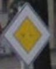|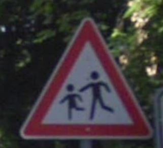|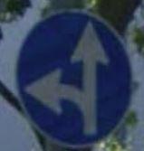|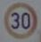|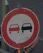|
|Priority road|Children crossing|Go straight or left|Speed limit (30km/h)|No passing|

All of these images were taken in reasonable lighting conditions, with good resolution and are not blurred.  They should be easy to classify.  The only possible complication would be the Children crossing sign where the model might have difficulty differentiating it from a Bicycles crossing sign. 

#### 2. Model Predictions 

For each sign, the model predicted the following:

| Image			        |     Predicted Label	|    Actual Label  |
|:---------------------:|:-----------------:| :-----------------:
|  | Priority road | Priority road |
|  | Children crossing | Children crossing | 
|  |Go straight or left | Go straight or left | 
|  | Speed limit (30km/h)| Speed limit (30km/h)
|  | No passing |  No passing |

The model correctly identified all 5 traffice signs, which gives an accuracy of 100% on this small sample.  This is close to the accuracy on the test set, and should be expected given how clear the signs were.

#### 3.   Top 5 softmax probabilities for each image.

To futher investicate the model predictions, the top 5 softmax probabilities are provided for each image in descending order.  As can be seen, the model acculately predicts each sign with high certainty.  The only one that was not predicted with nearly 100% certainty was the children crossing sign.  In that case the model gave the probabilities of 95.53% to children crossing, 3.14% to bicycles crossing, 1.18% to slippery road and 0.16% to road narrows on the right. 

<!---
| Sign Image | Softmax \#1 | Softmax \#2 | Softmax \#3 | Softmax \#4 | Softmax \#5 | 
|------------|-------------|-------------|-------------|-------------|------------|
|  | 1.00000000e+00 |3.11539768e-14 |  5.61218832e-16 | 7.86791170e-17 |7.64107098e-17 |
|  | 0.955307841e-01 | 3.13773006e-02 |  1.17888069e-02 | 1.46546320e-03 | 2.11854040e-05 |
['Children crossing' 'Bicycles crossing' 'Slippery road','Road narrows on the right' 'Dangerous curve to the left'] 
|  | 9.99999881e-01 | 6.74336746e-08   1.81311702e-10 | 4.59559751e-11 | 7.08749162e-12 |
|  |9.99968052e-01| 2.76912306e-05 |  3.27101657e-06 | 8.08065181e-07 | 7.97130255e-08 |
|  |1.00000000e+00 | 3.18112767e-12   3.62587598e-14 | 1.04058538e-15 | 2.07457202e-16 |
-->

| Sign Image | Softmax \#1 | Softmax \#2 | Softmax \#3 | Softmax \#4 | Softmax \#5 | 
|------------|-------------|-------------|-------------|-------------|------------|
|  | 1.0000 | 0.0000 | 0.0000 | 0.0000 | 0.0000 |
|  | 0.9553 | 0.0314 | 0.0118 | 0.0016 | 0.0000 |
|  | 1.0000 | 0.0000 | 0.0000 | 0.0000 | 0.0000 |
|  | 1.0000 | 0.0000 | 0.0000 | 0.0000 | 0.0000 |
|  | 1.0000 | 0.0000 | 0.0000 | 0.0000 | 0.0000 |
<!--- ['Children crossing' 'Bicycles crossing' 'Slippery road','Road narrows on the right' 'Dangerous curve to the left'] --->

### Visualizing the Neural Network 
The trained network feature maps can be visualized using a function included in the jupyter notebook.  Below is an image of the 1st layer of the convolution for the no passing sign.

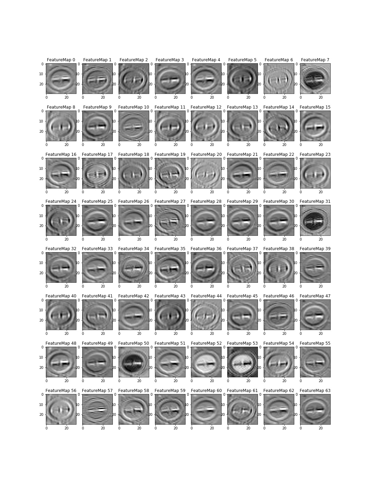 

### Further Research
* From reading papers on the project, the better models are build using the HOG (Histograms of Oriented Gradients) features of the images.  
* Higher resolution, more images, and a different type of convoluational neural network should also be researched.

